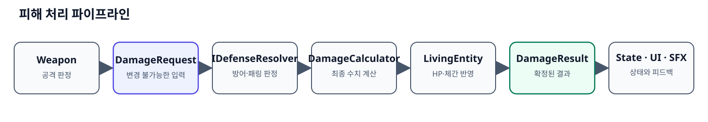
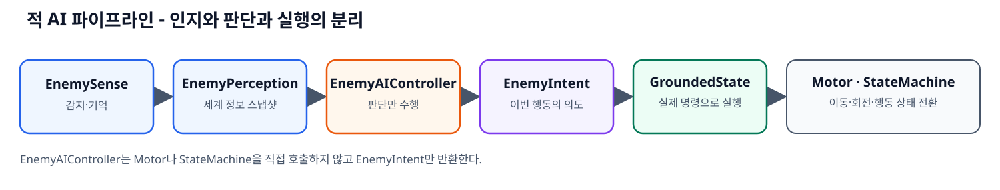
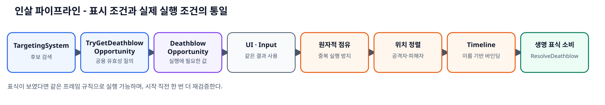

# 전투 시스템 리팩터링 기록 — 1~7단계

> 2026-07-29 이후 패링 반환 체간은 더 이상 두 번째 `DamageRequest`를 만들지 않는다.
> 현재 구조는 [PostureDamagePipelineRefactor.md](PostureDamagePipelineRefactor.md)를 함께 참고한다.

- 작업일: 2026-07-15
- 대상: 플레이어·적 공용 피해 처리, 체간, 방어/패링, 인살, 적 AI, 감지, 타겟팅, 전투 UI
- 목적: 한 달 뒤 코드를 다시 보더라도 **무엇이 바뀌었고, 왜 바뀌었으며, 어느 객체가 어떤 책임을 갖는지** 추적할 수 있게 한다.
- 현재 상태: 1~7단계 코드 반영 완료. C# 프로젝트 컴파일 기준 오류 0개.

> 이 문서는 설계 의도를 기록한다. 실제 동작의 최종 기준은 코드와 Unity Inspector 값이다. 물리 충돌, 애니메이션 이벤트, Timeline 바인딩처럼 Unity 런타임에 의존하는 항목은 문서 마지막의 플레이 테스트 목록으로 별도 확인한다.

## 0. 최종 구조 한눈에 보기

### 피해 처리 파이프라인



핵심 원칙은 **공격 요청과 처리 결과를 분리**하는 것이다. 공격자는 `DamageRequest`를 보내고, 피격자는 자신의 방어 상태를 이용해 결과를 확정한다. 이후 상태 머신과 연출은 동일한 `DamageResult`를 읽는다.

### 적 AI 파이프라인



`EnemyAIController`는 더 이상 직접 이동하거나 상태를 전환하지 않는다. 감지 결과를 읽고 `Chase`, `Strafe`, `Attack`, `Guard` 같은 의도만 반환한다. 실제 행동 명령은 상태가 수행한다.

### 인살 파이프라인



UI가 표시한 조건과 실제 입력이 실행하는 조건이 같은 질의 결과를 사용한다. 따라서 **표식이 떴는데 실행이 거절되거나, 표식이 없는데 실행되는 규칙 불일치**를 줄였다.

## 1. 단계별 요약

| 단계 | 핵심 문제 | 변경 결과 |
|---|---|---|
| 1 | 체간 처리와 Perfect Parry 붕괴 조건이 여러 곳에 흩어짐 | `LivingEntity`가 피해와 체간 적용 순서를 통제하고 Perfect Parry는 체간을 쌓되 붕괴시키지 않음 |
| 2 | HP 0과 인살 대기 상태가 구분되지 않고 인살이 과도한 피해로 흉내 내짐 | 일반 적은 HP 0에 즉시 사망, 인살 표식이 남은 적은 인살 해결 시 생명 표식을 소비 |
| 3 | 변경 가능한 `DamageEvent`가 여러 객체를 돌며 수정되고 플레이어/적 방어 규칙이 분리됨 | `DamageRequest → DamageCalculator → DamageResult` 공용 파이프라인과 `IDefenseResolver` 도입 |
| 4 | 인살 UI·입력 조건 중복, 취약한 Timeline 인덱스 바인딩, 위치 정렬과 중복 실행 방지 부족 | `DeathblowOpportunity` 단일 규칙, 원자적 점유, 정렬, 이름 기반 Timeline, 항상 종료되는 처리 도입 |
| 5 | AI 판단 코드가 이동과 상태 전환까지 직접 수행 | 감지 스냅샷 → 판단 → 의도 → 상태 실행으로 책임 분리 |
| 6 | 감지/추적 의미 혼합, 타겟 이벤트 중복, UI가 서로 다른 조건 사용 | `EnemyPerception`, 마지막 목격 위치, 단일 `TargetChanged`, 공용 인살 질의 도입 |
| 7 | 모호한 이름·공개 상태·중복 API·직렬화 버그·런타임 Editor 의존성 | 의도가 드러나는 API, 캡슐화, 직렬화 호환, 주석, 컴파일 검증 |

---

## 2. 1단계 — 체간 처리와 Perfect Parry 규칙 정리

### 기존에는 어땠나

HP 피해와 체간 피해가 별도 메서드로 적용되었고, 체간이 최대치에 도달하면 호출 경로와 방어 종류를 충분히 구분하지 않고 즉시 붕괴 이벤트를 발생시켰다.

```csharp
public virtual void TakePostureDamage(float amount)
{
    CurrentPosture += amount;

    if (CurrentPosture >= MaxPosture.GetValue())
    {
        CurrentPosture = MaxPosture.GetValue();
        OnPostureBroken?.Invoke();
    }
}
```

### 무엇이 문제였나

1. HP와 체간이 서로 다른 진입점으로 적용되어 한 번의 공격 결과가 여러 경로로 흩어졌다.
2. Perfect Parry의 설계 의도인 **경감된 체간은 쌓이지만 그 공격 자체로는 체간이 붕괴되지 않음**을 표현할 장소가 불명확했다.
3. 파생 클래스가 적용 순서를 임의로 바꾸기 쉬웠고, 공격 하나에 대한 확정 결과를 추적하기 어려웠다.

### 어떻게 바꿨나

`LivingEntity.ReceiveDamage`가 방어 판정, 수치 계산, HP/체간 반영, 결과 이벤트 발행 순서를 통제한다. Perfect Parry 결과일 때는 체간을 최대치 바로 아래까지 축적하되 붕괴 결과는 만들지 않는다.

```csharp
if (resolved.PostureDamage > 0f)
{
    float accumulatedPosture = CurrentPosture + resolved.PostureDamage;

    if (defense == DefenseType.PerfectParry)
    {
        // 경감 체간은 누적하지만 이 방어 자체로는 붕괴시키지 않는다.
        float protectedPostureLimit = Mathf.Max(0f, maxPosture - 1f);
        float cappedPosture = Mathf.Min(accumulatedPosture, protectedPostureLimit);
        CurrentPosture = Mathf.Max(previousPosture, cappedPosture);
    }
    else
    {
        CurrentPosture = Mathf.Min(accumulatedPosture, maxPosture);
        postureBroken = previousPosture < maxPosture
            && CurrentPosture >= maxPosture;
    }
}
```

> `maxPosture - 1f`는 현재 수치 모델에서 “붕괴 직전”을 나타내는 정책이다. 나중에 체간이 정수 단위가 아니거나 최대 체간이 1보다 작아질 수 있다면 `postureBreakEpsilon` 같은 명시적 값으로 교체하는 편이 좋다.

### 왜 이렇게 했나

- **Template Method**: 공통 처리 순서는 기반 클래스가 보장하고, 플레이어/적은 결과에 대한 반응만 구현한다.
- **단일 진입점**: 한 공격은 한 번만 계산되고 한 번만 적용된다.
- **도메인 규칙의 명시화**: Perfect Parry 예외를 상태 코드 곳곳의 조건문이 아니라 체간 적용 정책에 둔다.

### 반드시 확인할 동작

1. Perfect Parry로 체간이 최대치에 근접해도 붕괴 상태로 전환되지 않는다.
2. 그 직후 일반 방어 또는 피격으로 체간 피해를 받으면 정상적으로 붕괴할 수 있다.
3. Perfect Parry가 체간 피해 자체를 0으로 만들지는 않는다.

관련 코드:

- [`LivingEntity.cs`](../../Assets/_WORK/Scripts/Inheritance/LivingEntity.cs)
- [`DamageModels.cs`](../../Assets/_WORK/Scripts/PlayerScripts/Combat/DamageModels.cs)

---

## 3. 2단계 — 일반 사망과 인살 생명 표식 분리

### 기존에는 어땠나

인살은 사실상 최대 HP보다 훨씬 큰 피해를 다시 가하는 방식이었다. 인살 대기 상태와 일반 사망의 차이가 모델에 없었다.

```csharp
public void ExecuteDeathBlow(GameObject executor)
{
    DamageEvent damage = new DamageEvent
    {
        attacker = executor,
        currentDamage = MaxHp.Value * 10f
    };

    TakeDamage(ref damage);
}
```

### 무엇이 문제였나

1. “인살”이라는 규칙이 피해량 꼼수로 표현되어 의도가 드러나지 않았다.
2. 일반 적이 HP 0이 되었을 때 즉시 죽어야 하는지, 보스가 생명 표식을 잃을 때 다음 페이즈로 가야 하는지 구분할 수 없었다.
3. `BeingExecuteState`에 들어가야만 생명 표식을 소비하도록 강제하면, 일반 적의 HP 0 사망까지 인살 상태에 종속되는 문제가 생긴다.

### 어떻게 바꿨나

`EnemyStats`가 남은 인살 생명 표식을 관리한다.

- 인살 생명 표식이 없는 일반 적: HP 0이면 `LivingEntity.Die()`가 즉시 `IsDead = true`로 설정한다.
- 인살 생명 표식이 남은 적: 인살 가능 상태에서 죽음을 보류하고 마커를 연다.
- Timeline이 정상 종료되면 `ResolveDeathblow()`가 표식 하나를 소비한다.
- 마지막 표식이면 실제 `Die()`를 호출한다.
- 표식이 남았다면 HP/체간을 회복하고 다음 전투를 이어간다.

```csharp
public bool ResolveDeathblow()
{
    if (IsDead) return true;

    if (MaxDeathblowMarkers == 0)
    {
        Die();
        return true;
    }

    RemainingDeathblowMarkers = Mathf.Max(0, RemainingDeathblowMarkers - 1);
    DeathblowMarkersChanged?.Invoke(RemainingDeathblowMarkers, MaxDeathblowMarkers);

    if (RemainingDeathblowMarkers == 0)
    {
        Die();
        return true;
    }

    RestoreHealth(MaxHp.GetValue());
    ResetPosture(true);
    return false;
}
```

### 왜 이렇게 했나

- **HP 0**은 수치 상태이고, **사망**은 생명 주기 상태이며, **인살 가능**은 전투 기회 상태다. 세 개를 하나의 bool이나 큰 피해량으로 표현하지 않는다.
- 일반 적의 사망은 인살 시스템에 결합하지 않는다.
- 다중 생명/보스 페이즈가 “추가 피해”가 아니라 “표식 소비”라는 명시적인 규칙을 갖는다.

### 반드시 확인할 동작

1. 생명 표식이 없는 일반 적은 HP 0에서 인살 없이 바로 죽는다.
2. 인살 표식이 있는 적은 유효한 인살이 끝나기 전까지 제거되지 않는다.
3. 마지막 표식에서만 `IsDead`가 true가 된다.
4. 중간 표식 소비 후 HP·체간·상태가 다음 전투가 가능한 값으로 복구된다.

관련 코드:

- [`EnemyStats.cs`](../../Assets/_WORK/Scripts/EnemyScripts/EnemyStats.cs)
- [`EnemyBeingExecuteState.cs`](../../Assets/_WORK/Scripts/EnemyScripts/EnemyState/EnemyBeingExecuteState.cs)
- [`LivingEntity.cs`](../../Assets/_WORK/Scripts/Inheritance/LivingEntity.cs)

---

## 4. 3단계 — 공용 피해·방어 파이프라인

### 기존에는 어땠나

`DamageEvent` 하나를 생성한 뒤 공격자, 방어자, 피격자가 같은 구조체의 값을 계속 변경했다.

```csharp
public struct DamageEvent
{
    public GameObject attacker;
    public AttackData attackData;
    public float currentDamage;
    public float currentPostureDamage;
    public float currentKnockbackForce;
    public bool wasGuarded;
    public bool wasParried;
    public bool isCancelled;
}
```

플레이어와 적은 서로 다른 코드 경로에서 방어/패링을 판정했고, `wasGuarded`, `wasParried`, `isCancelled`의 조합으로 유효하지 않은 상태도 만들 수 있었다.

### 무엇이 문제였나

1. **입력과 결과가 같은 자료형**이라 어느 시점의 값이 원본인지 알기 어려웠다.
2. 여러 객체가 동일 데이터를 수정해 디버깅 시 책임 소재가 불명확했다.
3. bool 여러 개로 `일반 피격/방어/Perfect Parry`를 표현해 상호 모순된 조합이 가능했다.
4. 플레이어만 방어하는 구조로 굳어지기 쉬워, “적도 공격을 패링하고 방어한다”는 요구를 공통 규칙으로 확장하기 어려웠다.

### 어떻게 바꿨나

#### 4.1 변경 불가능한 요청과 결과 분리

```csharp
public readonly struct DamageRequest
{
    public readonly GameObject Attacker;
    public readonly AttackData AttackData;
    public readonly float HealthDamage;
    public readonly float PostureDamage;
    public readonly bool CanBeDefended;
}

public readonly struct DamageResult
{
    public readonly DamageRequest Request;
    public readonly DefenseType Defense;
    public readonly float HealthDamage;
    public readonly float PostureDamage;
    public readonly bool PostureBroken;
    public readonly bool TargetDied;
}
```

공격 입력인 `DamageRequest`는 생성 후 바뀌지 않는다. `DamageCalculator`가 방어 종류와 공격 데이터를 이용해 `DamageResult`를 만들며, 그 결과 역시 확정 후 바뀌지 않는다.

#### 4.2 방어 판정 계약 통일

```csharp
public interface IDefenseResolver
{
    DefenseType ResolveDefense(in DamageRequest request);
}
```

플레이어와 적 전투 컴포넌트가 동일한 계약을 구현한다. 적의 `EnemyGuardState`는 진입 직후 짧은 구간에 `PerfectParry`, 이후 `NormalGuard`를 설정한다.

```csharp
public override void Enter()
{
    stateTimer = 0f;
    enemy.Combat.SetDefense(DefenseType.PerfectParry);
}

public override void Update()
{
    stateTimer += Time.deltaTime;

    if (stateTimer > DeflectWindowDuration)
        enemy.Combat.SetDefense(DefenseType.NormalGuard);
}
```

#### 4.3 처리 순서 통일

```csharp
public DamageResult ReceiveDamage(in DamageRequest request)
{
    if (!CanReceiveDamage(request))
        return DamageResult.Ignored(request);

    DefenseType defense = DefenseResolver != null
        ? DefenseResolver.ResolveDefense(request)
        : DefenseType.None;

    ResolvedDamageValues resolved = DamageCalculator.Resolve(
        request,
        defense,
        Defense.GetValue(),
        perfectParryPostureMultiplier,
        failedGuardHealthMultiplier);

    // 여기서 CurrentHp/CurrentPosture를 반영하고 아래 결과 플래그를 계산한다.
    DamageResult result = new DamageResult(
        request,
        true,
        defense,
        appliedHealthDamage,
        appliedPostureDamage,
        request.KnockbackForce,
        postureBroken,
        healthDepleted,
        killed);

    DamageResolved?.Invoke(result);

    if (defense == DefenseType.PerfectParry)
        ApplyDeflectPosture(request, resolved.PostureDamage);

    return result;
}
```

위 예시는 처리 순서를 보여 주기 위해 중간의 HP·체간 반영 부분만 주석으로 접은 발췌다. 실제 계산과 Perfect Parry 반사는 `LivingEntity.ReceiveDamage` 한 메서드 안에 명시되어 있다.

### 왜 이렇게 했나

- **Value Object**: 요청과 결과가 변경 불가능하여 파이프라인의 각 단계가 명확하다.
- **DIP**: `LivingEntity`는 플레이어/적 클래스가 아니라 `IDefenseResolver` 계약에 의존한다.
- **OCP**: 새로운 방어 종류나 계산 정책을 추가할 때 무기·UI·상태 전체를 동시에 고치지 않도록 한다.
- **동일 규칙**: 플레이어와 적 모두 `PerfectParry`, `NormalGuard`, `None`을 같은 방식으로 처리한다.

### 반드시 확인할 동작

1. 플레이어 공격을 적이 일반 방어할 수 있다.
2. 적이 방어 상태에 막 진입한 짧은 시간에는 플레이어 공격을 Perfect Parry할 수 있다.
3. 공격 데이터가 방어 불가라면 양쪽 모두 방어 결과가 나오지 않는다.
4. 애니메이션, SFX, 상태 전환이 같은 `DamageResult.Defense` 값을 사용한다.

관련 코드:

- [`DamageModels.cs`](../../Assets/_WORK/Scripts/PlayerScripts/Combat/DamageModels.cs)
- [`IDamageable.cs`](../../Assets/_WORK/Scripts/Inheritance/IDamageable.cs)
- [`LivingEntity.cs`](../../Assets/_WORK/Scripts/Inheritance/LivingEntity.cs)
- [`PlayerCombat.cs`](../../Assets/_WORK/Scripts/PlayerScripts/Combat/PlayerCombat.cs)
- [`EnemyCombat.cs`](../../Assets/_WORK/Scripts/EnemyScripts/EnemyCombat.cs)
- [`EnemyGuardState.cs`](../../Assets/_WORK/Scripts/EnemyScripts/EnemyState/EnemyGuardState.cs)

---

## 5. 4단계 — 인살 기회, 위치 정렬, Timeline 실행 안정화

### 기존에는 어땠나

- UI와 입력 코드가 각자 거리·각도 조건을 계산했다.
- 앞/뒤 판정이 명확한 기준 벡터 없이 구현되어 있었다.
- Timeline 트랙을 `outputs.ElementAt(1)`, `ElementAt(2)`처럼 순서로 바인딩했다.
- 인살 시작 시 대상 점유, 재검증, 충돌 가능한 위치 확인, 실패 시 복구가 부족했다.

```csharp
bool isFront = Vector3.Dot(enemy.transform.forward, transform.forward) < 0f;

var outputs = timelineAsset.outputs;
director.SetGenericBinding(outputs.ElementAt(1).sourceObject, playerAnimator);
director.SetGenericBinding(outputs.ElementAt(2).sourceObject, enemyAnimator);
```

### 무엇이 문제였나

1. UI와 실제 실행 조건이 달라질 수 있었다.
2. 공격자와 피해자의 위치가 맞지 않아 발 미끄러짐, 순간이동, 캐릭터 겹침이 발생할 수 있었다.
3. Timeline 트랙 순서가 바뀌면 엉뚱한 Animator에 바인딩된다.
4. 한 적에게 여러 실행 요청이 들어오거나 Timeline 중단 시 상태가 영구 잠길 수 있었다.
5. 세키로처럼 **실패 가능한 미니게임**이 아니라 **가능할 때만 표식을 표시하고 입력을 받는 구조**가 아니었다.

### 어떻게 바꿨나

#### 5.1 인살 가능성의 단일 값 객체

```csharp
public readonly struct DeathblowOpportunity
{
    public readonly Enemy Target;
    public readonly TimelineAsset Timeline;
    public readonly DeathblowApproach Approach;
    public readonly Vector3 AttackerPosition;
    public readonly Quaternion AttackerRotation;
    public readonly Quaternion VictimRotation;
}
```

`PlayerExecution.TryCreateDeathblowOpportunity`가 다음을 모두 통과할 때만 이 값을 만든다.

- 대상이 살아 있고 인살 점유 중이 아님
- 적이 열어 둔 인살 상태이거나 은신 인살 조건 충족
- 거리와 앞/뒤 각도 유효
- 공격자와 피해자가 설 정렬 위치에 설 수 있음
- 벽/장애물이 정렬을 막지 않음
- 해당 방향의 Timeline과 Animator를 바인딩할 수 있음

#### 5.2 UI와 입력이 동일 질의 사용

```csharp
if (!targetingSystem.TryGetDeathblowOpportunity(out DeathblowOpportunity opportunity))
    return;

stateMachine.RequestedDeathblowOpportunity = opportunity;
stateMachine.TransitionTo(stateMachine.ExecuteState);
```

`TargetingUI`도 같은 `TryGetDeathblowOpportunity`를 사용하므로 유효한 기회가 있을 때만 표식을 표시한다.

#### 5.3 실행 직전 재검증과 점유

```csharp
public bool TryStartDeathblow(in DeathblowOpportunity requested)
{
    if (!TryCreateDeathblowOpportunity(requested.Target, out DeathblowOpportunity refreshed))
        return false;

    if (!refreshed.Target.TryBeginBeingExecuted())
        return false;

    StartCoroutine(AlignAndPlayTimeline(refreshed));
    return true;
}
```

표식이 보인 시점과 버튼을 누른 시점 사이에 적이 움직이거나 죽을 수 있으므로 실행 직전에 다시 검사한다. 점유는 한 번에 한 실행자만 성공하도록 한다.

#### 5.4 이름 기반 Timeline 바인딩

Timeline 트랙 이름을 다음처럼 고정했다.

- `AttackerAnimation`
- `VictimAnimation`

코드는 출력 인덱스가 아니라 이름을 찾아 바인딩한다. 트랙 순서를 바꿔도 의미가 보존된다.

#### 5.5 성공·중단 모두 정리

Timeline 종료 콜백에서 표식 소비와 상태 복귀를 처리하고, 객체 비활성화나 중단 경로에서도 점유·충돌·상태를 해제한다. 인살은 시작 이후 조작으로 실패시키는 구조가 아니라, **시작 전에 조건을 모두 검증하고 시작했다면 끝까지 해결하는 구조**다.

### 왜 이렇게 했나

- **Specification/Query 역할**: 인살 가능 조건을 한 질의로 모았다.
- **TOCTOU 방지**: 표시 때의 결과를 맹신하지 않고 실행 순간 재검증한다.
- **원자적 점유**: 중복 실행을 방지한다.
- **의미 기반 바인딩**: 배열 위치보다 이름이 변경에 강하다.
- **세키로식 UX**: 실패 연출을 만드는 대신, 성공 가능한 순간에만 표식을 노출한다.

### Inspector에서 확인할 값

`PlayerExecution`에서 다음 레이어가 실제 프로젝트 레이어와 일치해야 한다.

- 실행 위치 충돌 검사 레이어
- 지면 검사 레이어
- 최대 인살 거리(현재 기본값 2.2m)
- 위치 정렬 시간(현재 기본값 0.12초)

Timeline 두 개의 애니메이션 트랙 이름도 `AttackerAnimation`, `VictimAnimation`인지 확인한다.

관련 코드와 에셋:

- [`PlayerExecution.cs`](../../Assets/_WORK/Scripts/PlayerScripts/Combat/PlayerExecution.cs)
- [`PlayerExecuteState.cs`](../../Assets/_WORK/Scripts/PlayerScripts/PlayerState/PlayerExecuteState.cs)
- [`TargetingSystem.cs`](../../Assets/_WORK/Scripts/PlayerScripts/TargetingSystem.cs)
- [`TargetingUI.cs`](../../Assets/_WORK/Scripts/PlayerScripts/TargetingUI.cs)
- [`EnemyBeingExecuteState.cs`](../../Assets/_WORK/Scripts/EnemyScripts/EnemyState/EnemyBeingExecuteState.cs)
- [`FrontDeathBlow.playable`](../../Assets/_WORK/ScriptableObject/TimeLine/FrontDeathBlow.playable)
- [`BehindDeathBlow.playable`](../../Assets/_WORK/ScriptableObject/TimeLine/BehindDeathBlow.playable)

---

## 6. 5단계 — 적 AI 판단과 상태 실행 분리

### 기존에는 어땠나

`EnemyAIController`가 감지 결과를 읽는 동시에 이동 명령과 상태 전환까지 직접 수행했다.

```csharp
switch (currentState)
{
    case AIBrainState.Chasing:
        enemy.Motor.Chase(target.position);
        break;

    case AIBrainState.CombatReady:
        enemy.Motor.CombatStrafe(target);

        if (CanAttack())
            enemy.StateMachine.TransitionTo(enemy.StateMachine.AttackState);
        break;
}
```

AI 내부에도 `Attacking`, `Defending` 같은 상태가 있고 실제 `EnemyStateMachine`에도 공격/방어 상태가 있어 상태의 진실 공급원이 둘이었다.

### 무엇이 문제였나

1. AI 판단 코드가 `EnemyMotor`와 `EnemyStateMachine`에 강하게 결합했다.
2. “무엇을 할지 결정”과 “어떻게 실행할지”가 한 클래스에 섞였다.
3. AI 뇌 상태와 실제 캐릭터 상태가 서로 다르게 남을 수 있었다.
4. 판단 로직 단위 테스트가 사실상 불가능했다. 판단을 확인하려면 NavMesh와 상태 머신까지 함께 실행해야 했다.
5. 공격/방어가 끝날 때 여러 전용 콜백으로 AI 상태를 수동 동기화해야 했다.

### 어떻게 바꿨나

#### 6.1 전술 모드는 큰 상황만 표현

```csharp
public enum EnemyTacticalMode
{
    Idle,
    Chase,
    Engage
}
```

공격 중인지, 방어 중인지는 실제 상태 머신이 표현한다. AI는 `Idle`, `Chase`, `Engage`처럼 판단에 필요한 큰 맥락만 가진다.

#### 6.2 AI는 의도만 반환

```csharp
public readonly struct EnemyIntent
{
    public readonly EnemyIntentType Type;
    public readonly Vector3 TargetPosition;
    public readonly EnemyAttackData Attack;
}

public EnemyIntent EvaluateIntent(in EnemyPerception perception)
{
    if (!perception.HasTarget)
        return EnemyIntent.Hold();

    if (TacticalMode == EnemyTacticalMode.Chase)
        return EnemyIntent.Chase(perception.TargetPosition);

    if (TryChooseGuard())
        return EnemyIntent.Guard();

    if (TryChooseAttack(perception.Distance, out EnemyAttackData attack))
        return EnemyIntent.AttackWith(attack);

    return EnemyIntent.Strafe(perception.TargetPosition);
}
```

#### 6.3 GroundedState가 실행 경계가 됨

```csharp
EnemyPerception perception = enemy.Sense.CurrentPerception;
EnemyIntent intent = enemy.AIController.EvaluateIntent(perception);

switch (intent.Type)
{
    case EnemyIntentType.Chase:
        enemy.Motor.Chase(intent.TargetPosition);
        break;

    case EnemyIntentType.Attack:
        stateMachine.RequestAttack(intent.Attack);
        stateMachine.TransitionTo(stateMachine.EnemyAttackState);
        break;

    case EnemyIntentType.Guard:
        stateMachine.TransitionTo(stateMachine.EnemyGuardState);
        break;
}
```

#### 6.4 공격·방어 상태는 실행에만 집중

- `EnemyAttackState`: 요청된 공격 소비 → WindUp → Active → Recovery → 종료 통지
- `EnemyGuardState`: Perfect Parry 구간 → Normal Guard 구간 → 종료 통지
- `EnemyAIController.NotifyActionCompleted()`: 공격/방어 종류와 무관하게 다음 판단 가능 시점을 연다.

### 왜 이렇게 했나

- **SRP**: Sense는 인지, AI는 판단, State는 행동 절차, Motor는 물리 실행을 맡는다.
- **Command 성격의 Intent**: AI 결과를 자료로 전달해 판단과 실행 사이의 경계를 만든다.
- **State Pattern 정리**: 실제 행동 상태는 `EnemyStateMachine` 하나가 소유한다.
- **테스트 가능성**: `EnemyPerception`을 주고 어떤 `EnemyIntent`가 나오는지 독립적으로 검사할 수 있다.

### 반드시 확인할 동작

1. 타겟이 없을 때 Idle/Hold 상태로 멈춘다.
2. 공격 범위 밖에서는 마지막으로 본 위치까지 추격한다.
3. 교전 범위에서는 Strafe, Attack, Guard 중 하나를 선택한다.
4. 공격/방어 상태가 끝나면 GroundedState로 돌아가 새 의도를 평가한다.
5. 같은 Hold/Chase 명령을 매 프레임 불필요하게 초기화하지 않는다.

관련 코드:

- [`EnemyAIController.cs`](../../Assets/_WORK/Scripts/EnemyScripts/EnemyAIController.cs)
- [`EnemyGroundedState.cs`](../../Assets/_WORK/Scripts/EnemyScripts/EnemyState/EnemyGroundedState.cs)
- [`EnemyAttackState.cs`](../../Assets/_WORK/Scripts/EnemyScripts/EnemyState/EnemyAttackState.cs)
- [`EnemyGuardState.cs`](../../Assets/_WORK/Scripts/EnemyScripts/EnemyState/EnemyGuardState.cs)
- [`EnemyStateMachine.cs`](../../Assets/_WORK/Scripts/EnemyScripts/EnemyState/EnemyStateMachine.cs)
- [`EnemyMotor.cs`](../../Assets/_WORK/Scripts/EnemyScripts/EnemyMotor.cs)

---

## 7. 6단계 — 감지, 타겟팅, 인살 UI의 의미 정리

### 기존에는 어땠나

`EnemySense`는 물리 검색 결과의 첫 번째 항목을 사용했고, 타겟을 한 번 발견한 뒤에는 현재 Transform 위치를 계속 읽었다.

```csharp
int count = Physics.OverlapSphereNonAlloc(..., overlapResults, targetLayer);

if (count > 0)
{
    CurrentTarget = overlapResults[0].transform;
    IsTargetDetected = true;
}
```

`IsTargetDetected`가 “지금 눈으로 보고 있음”, “경계 중”, “전에 봤던 대상을 기억함”을 동시에 의미했다. 타겟팅은 선택과 해제 이벤트가 따로였고, UI와 입력이 별도 인살 조건을 계산했다.

### 무엇이 문제였나

1. 검색 배열 순서는 가까운 순서가 아니므로 임의의 타겟을 선택할 수 있었다.
2. 시야가 끊긴 뒤에도 `CurrentTarget.position`을 읽으면 벽 너머 플레이어의 실시간 위치를 아는 치팅 AI가 된다.
3. `IsTargetDetected`와 `SetDetectState`는 현재 시야인지 기억/경계인지 이름만으로 알 수 없었다.
4. 타겟 선택/해제 이벤트를 각각 구독해야 해 UI 상태 정리가 누락되기 쉬웠다.
5. 파괴된 Unity 객체가 인터페이스 참조로 남으면 일반 null 검사만으로 놓칠 수 있었다.

### 어떻게 바꿨나

#### 7.1 명시적인 감지 스냅샷

```csharp
public readonly struct EnemyPerception
{
    public readonly Transform Target;
    public readonly Vector3 TargetPosition;
    public readonly float Distance;
    public readonly bool CanSeeTarget;

    public bool HasTarget => Target != null;
}
```

`EnemySense`는 현재 보이는 가장 가까운 유효 대상을 선택한다. 보이는 동안에만 `LastKnownTargetPosition`을 갱신한다. 시야가 끊기면 AI에는 마지막으로 본 위치를 전달하고, 기억 시간이 끝나면 타겟을 완전히 잊는다.

```csharp
if (TryFindBestVisibleTarget(out Transform visibleTarget, out Vector3 visiblePosition))
{
    CurrentTarget = visibleTarget;
    LastKnownTargetPosition = visiblePosition;
    CanSeeTarget = true;
    loseTargetTimer = loseTargetTime;
}
else
{
    CanSeeTarget = false;
    UpdateTargetMemory();
}
```

의미가 불명확했던 `SetDetectState`는 외부에서 특정 대상을 경계시키는 `AlertTo(Transform target)`로 바뀌었다.

#### 7.2 타겟 변경 이벤트 통일

```csharp
public event Action<ITargetable> TargetChanged;

private void SelectTarget(ITargetable target)
{
    currentTarget = target;
    TargetChanged?.Invoke(CurrentTarget);
}

private void DeselectTarget()
{
    currentTarget = null;
    TargetChanged?.Invoke(null);
}
```

UI는 하나의 이벤트만 구독하며 null을 받으면 즉시 숨는다. `CurrentTarget` getter는 Unity에서 파괴된 객체까지 null로 취급한다.

#### 7.3 인살 마커는 공용 기회 질의만 표시

```csharp
bool hasDeathblow = targetingSystem.TryGetDeathblowOpportunity(
    out DeathblowOpportunity opportunity);

deathblowMarker.SetActive(hasDeathblow);
```

타겟이 고정되지 않았더라도 가까운 은신 인살 후보를 같은 규칙으로 검색한다. UI는 표시만 하며 규칙을 소유하지 않는다.

### 왜 이렇게 했나

- **현재 관측과 기억 분리**: AI가 알 수 있는 정보의 범위를 명확히 한다.
- **Snapshot**: 한 판단 주기 안에서 일관된 인지 정보를 사용한다.
- **Observer 단순화**: 타겟의 모든 변경을 단일 이벤트로 전달한다.
- **Presentation 분리**: UI는 규칙을 재구현하지 않고 도메인 질의 결과만 보여 준다.

### 반드시 확인할 동작

1. 여러 플레이어/타겟이 감지 범위에 있을 때 가장 가까운 유효 대상을 선택한다.
2. 벽 뒤로 숨으면 적은 마지막 목격 위치까지만 추격한다.
3. 기억 시간이 끝나면 추격을 멈춘다.
4. 락온 중 대상이 파괴되면 락온과 UI가 즉시 정리된다.
5. 인살 마커는 실제 실행 가능한 거리·각도·공간에서만 나타난다.

관련 코드:

- [`EnemySense.cs`](../../Assets/_WORK/Scripts/EnemyScripts/EnemySense.cs)
- [`TargetingSystem.cs`](../../Assets/_WORK/Scripts/PlayerScripts/TargetingSystem.cs)
- [`TargetingUI.cs`](../../Assets/_WORK/Scripts/PlayerScripts/TargetingUI.cs)
- [`EnemyUI.cs`](../../Assets/_WORK/Scripts/EnemyScripts/EnemyUI.cs)

---

## 8. 7단계 — 네이밍, 캡슐화, 결합도, 직렬화 안전성 정리

7단계는 새로운 기능 하나를 추가한 단계가 아니라, 앞 단계의 구조를 유지보수 가능한 API로 마무리한 단계다.

### 8.1 공격 데이터의 방어 가능 여부 버그

#### 기존 문제

`EnemyAttackData`에 인스펙터용 `canBeGuarded` 또는 `CanBeGuarded`가 따로 있었지만, 실제 `DamageRequest`는 기반 클래스의 `AttackData.CanGuard`를 읽었다. 따라서 Inspector에서 적 공격을 방어 불가로 설정해도 실제 계산에는 반영되지 않을 수 있었다.

#### 변경

```csharp
[SerializeField] private bool canBeGuarded = true;

// DamageRequest가 실제로 읽는 기반 계약을 재정의한다.
public override bool CanGuard => canBeGuarded;
```

이 변경은 단순 이름 정리가 아니라 실제 전투 규칙 오류 수정이다.

### 8.2 명령과 상태를 외부에서 마음대로 수정하지 못하게 함

#### 기존 문제

공격 요청 데이터가 상태 머신의 공개 필드/프로퍼티로 남아 여러 코드가 덮어쓸 수 있었다.

#### 변경

```csharp
private EnemyAttackData requestedAttack;

public void RequestAttack(EnemyAttackData attack)
{
    requestedAttack = attack;
}

public EnemyAttackData ConsumeRequestedAttack()
{
    EnemyAttackData attack = requestedAttack;
    requestedAttack = null;
    return attack;
}
```

공격 상태가 요청을 한 번 소비하면 값이 지워진다. 오래된 공격 요청이 다음 상태 진입에 재사용되는 것을 막는다.

### 8.3 모호한 메서드 이름 변경

| 기존 이름 | 변경 이름 | 이유 |
|---|---|---|
| `EnemyAttackStart` | `OpenAttackHitWindow` | 애니메이션 전체 시작인지, 무기 판정 시작인지 명확히 함 |
| `EnemyAttackEnd` | `CloseAttackHitWindow` | 무기 충돌 판정 구간 종료임을 명시 |
| `ForceResetAttackState` | `CancelAttack` | 강제 리셋의 대상보다 호출 의도를 표현 |
| `RotationToDirect` | `RotateTowards` | 영어 문법과 동작 방향을 명확히 함 |
| `CombatStrafe` | `StrafeAround` | 무엇을 중심으로 이동하는지 드러냄 |
| `SwitchTargetUpdates` | `UpdateTargetSwitch` | Unity Update 메서드처럼 매 프레임 갱신하는 역할을 표현 |
| `SetUp` | `InitializeFromData` | 무엇으로 초기화하는지 표현 |
| `IsTargetableDead` | `IsDead` | 인터페이스 맥락상 중복 단어 제거 |
| `SetDetectState` | `AlertTo` | bool 상태 변경이 아니라 대상에게 경계시키는 행위임을 표현 |

### 8.4 인터페이스 역할 축소

`IDamageable`에서 외부 사망 명령인 `Die()`를 제거했다.

```csharp
public interface IDamageable
{
    Faction TargetFaction { get; }
    bool IsDead { get; }

    DamageResult ReceiveDamage(in DamageRequest request);
}
```

공격자는 피해를 요청할 수 있을 뿐, 피격자의 생명 주기를 직접 끝낼 권한은 없다. 실제 사망은 `LivingEntity`가 HP·인살 표식 정책을 적용한 뒤 내부에서 결정한다.

### 8.5 `Enemy`를 조립 지점으로 제한

`Enemy`는 Sense, AI, Motor, Combat, Stats, StateMachine을 연결하고 결과를 올바른 상태로 라우팅하는 **Composition Root** 역할을 한다. 각 세부 규칙을 `Enemy`에 다시 구현하지 않는다.

### 8.6 UI 초기화 오류 수정

기존 `EnemyUI.Init`은 새 매개변수를 검사한 뒤 기존 필드를 역참조하는 순서 때문에 초기 연결 시 null 오류가 날 수 있었다. `Bind`는 기존 구독을 먼저 해제하고, 새 `EnemyStats`를 저장한 다음 이벤트를 구독한다.

```csharp
public void Bind(EnemyStats stats)
{
    Unsubscribe();
    enemyStats = stats;

    if (enemyStats == null)
        return;

    enemyStats.OnHealthChanged += HandleHealthChanged;
    enemyStats.OnPostureChanged += HandlePostureChanged;
    RefreshAll();
}
```

### 8.7 런타임 코드에서 Editor 의존 제거

`EnemyAIController`가 런타임 어셈블리에서 `UnityEditor.Handles`를 사용하던 코드를 제거하고 `Gizmos` 기반 디버그 표시만 남겼다. 빌드 대상에서 `UnityEditor` 네임스페이스를 참조하는 문제를 막는다.

### 8.8 Inspector 직렬화 값 보존

이름을 바꾼 직렬화 필드는 기존 프리팹/씬 값을 잃지 않도록 `FormerlySerializedAs`를 사용했다.

```csharp
[FormerlySerializedAs("detectionRange")]
[SerializeField] private float lockOnRange = 15f;

[FormerlySerializedAs("backstabRange")]
[SerializeField] private float nearbyDeathblowSearchRadius = 2.2f;
```

필드를 public에서 private `[SerializeField]`로 바꾼 경우에도 직렬화 필드 이름은 유지했다. 코드 캡슐화는 강화하면서 에셋 데이터는 보존한다.

### 8.9 주석 원칙

이번에 새로 만들거나 구조를 크게 바꾼 클래스에는 다음 내용을 주석으로 남겼다.

- 이 클래스가 소유하는 책임
- 이 클래스가 **소유하지 않는** 책임
- 외부에서 호출해야 하는 공개 API의 의미
- Perfect Parry, 인살 표식, 마지막 목격 위치처럼 오해하기 쉬운 정책의 이유
- 상태 진입/종료 시 반드시 정리해야 하는 값

주석은 코드 한 줄을 한국어로 번역하는 용도가 아니라, **왜 이 경계와 규칙이 필요한지**를 설명하는 용도로 작성했다.

관련 코드:

- [`EnemyAttackData.cs`](../../Assets/_WORK/Scripts/EnemyScripts/EnemyAttackData.cs)
- [`EnemyCombat.cs`](../../Assets/_WORK/Scripts/EnemyScripts/EnemyCombat.cs)
- [`EnemyMotor.cs`](../../Assets/_WORK/Scripts/EnemyScripts/EnemyMotor.cs)
- [`EnemyStateMachine.cs`](../../Assets/_WORK/Scripts/EnemyScripts/EnemyState/EnemyStateMachine.cs)
- [`Enemy.cs`](../../Assets/_WORK/Scripts/EnemyScripts/Enemy.cs)
- [`EnemyUI.cs`](../../Assets/_WORK/Scripts/EnemyScripts/EnemyUI.cs)
- [`IDamageable.cs`](../../Assets/_WORK/Scripts/Inheritance/IDamageable.cs)
- [`ITargetable.cs`](../../Assets/_WORK/Scripts/Inheritance/ITargetable.cs)

---

## 9. SOLID와 패턴 관점에서 최종 평가

### SRP — 단일 책임

| 클래스 | 현재 책임 |
|---|---|
| `EnemySense` | 물리 세계에서 타겟을 감지하고 마지막 관측 정보를 기억 |
| `EnemyAIController` | 감지 정보로 다음 행동 의도를 선택 |
| `EnemyGroundedState` | 의도를 이동/상태 전환 명령으로 실행 |
| `EnemyMotor` | NavMesh 이동과 회전 수행 |
| `EnemyCombat` | 공격 판정 창과 현재 방어 상태 관리 |
| `EnemyStats` | HP·체간·인살 생명 표식 정책 관리 |
| `EnemyStateMachine` | 현재 상태와 상태 전환 관리 |
| `TargetingSystem` | 락온 대상 선택과 인살 기회 질의 연결 |
| `PlayerExecution` | 인살 유효성, 점유, 정렬, Timeline 실행 |
| `TargetingUI` / `EnemyUI` | 계산된 상태를 화면에 표시 |

이전보다 책임은 뚜렷해졌다. 특히 AI 판단이 Motor와 StateMachine을 직접 호출하지 않게 된 것이 가장 큰 개선이다.

### OCP — 개방/폐쇄

새로운 공격, 방어 타입, AI 의도, 인살 방향을 추가할 때 기존 코드를 완전히 닫아 두는 수준은 아니지만, 변경 지점은 명확해졌다. 예를 들어 새 AI 행동은 `EnemyIntentType`, 판단, GroundedState 실행 분기, 새 State만 확장하면 된다.

### LSP — 리스코프 치환

`LivingEntity` 파생 클래스는 공통 피해 처리 순서를 깨지 않고 결과 훅으로 반응한다. 기반 `AttackData.CanGuard`를 `EnemyAttackData`가 제대로 재정의하도록 고친 것도 계약 위반을 막는 수정이다.

### ISP — 인터페이스 분리

`IDamageable`에서 외부 사망 명령을 제거하여 “피해를 받을 수 있음” 계약만 남겼다. `ITargetable`은 락온에 필요한 Transform, LockOnPoint, 사망 여부에 집중한다.

### DIP — 의존 역전

`LivingEntity`는 구체적인 `PlayerCombat` 또는 `EnemyCombat` 대신 `IDefenseResolver`를 사용한다. 아직 Unity `MonoBehaviour` 참조가 많은 런타임 구조이므로 완전한 순수 도메인 계층은 아니지만, 전투 계산의 핵심 결합은 줄었다.

### 사용한 패턴

- **State**: 플레이어와 적의 행동 수명 주기
- **Strategy/Policy**: `IDefenseResolver`, `DamageCalculator`
- **Value Object**: `DamageRequest`, `DamageResult`, `EnemyPerception`, `EnemyIntent`, `DeathblowOpportunity`
- **Observer**: 피해/체간/타겟 변경 이벤트와 UI 구독
- **Template Method**: `LivingEntity` 공통 피해 적용 후 파생 객체 반응
- **Composition Root**: `Enemy`가 적 구성 요소를 연결

---

## 10. Unity Inspector 및 에셋 마이그레이션 확인

코드가 컴파일되어도 Inspector 연결이 빠지면 런타임 동작은 실패한다. 아래 항목을 프리팹에서 확인한다.

### Enemy 프리팹

- `Enemy`에 Stats, Sense, AI, Motor, Combat, StateMachine, Animator 연결
- `EnemyAIController`의 공격 목록과 공격/방어 확률·쿨다운
- `EnemySense`의 target layer, obstacle layer, 시야 거리·각도·기억 시간
- `EnemyGuardState`의 Perfect Parry 유효 시간
- 각 `EnemyAttackData`의 `canBeGuarded` 값
- `EnemyStats`의 인살 생명 표식 수

### Player 프리팹

- `TargetingSystem`의 target layer, obstacle layer, 락온 거리
- `PlayerExecution`의 지면/장애물 레이어와 Timeline 두 개
- `PlayableDirector`와 공격자 Animator 연결
- `TargetingUI`의 락온/인살 마커 연결

### Timeline

- 앞 인살과 뒤 인살 Timeline 모두 애니메이션 트랙 이름 확인
  - `AttackerAnimation`
  - `VictimAnimation`
- 트랙에 빈 애니메이션 구간이나 예상하지 않은 extrapolation이 없는지 확인
- Timeline 종료 신호가 없어도 `PlayableDirector.stopped`에서 정리되는지 확인

---

## 11. 플레이 테스트 체크리스트

### 피해와 체간

- [ ] 일반 피격에서 HP와 체간이 한 번만 감소/증가한다.
- [ ] 일반 방어가 HP 피해와 체간 피해를 설정값대로 경감한다.
- [ ] Perfect Parry도 경감된 체간을 누적한다.
- [ ] Perfect Parry만으로는 체간 붕괴가 발생하지 않는다.
- [ ] 그 다음 일반 피격/방어는 체간을 정상 붕괴시킨다.

### 적 방어와 공격

- [ ] 적이 교전 중 Guard 의도를 선택한다.
- [ ] Guard 진입 직후 약 0.2초는 Perfect Parry다.
- [ ] 이후에는 NormalGuard로 바뀐다.
- [ ] 방어 불가 공격은 `EnemyAttackData.canBeGuarded = false`일 때 실제로 방어되지 않는다.
- [ ] 공격의 WindUp/Active/Recovery와 애니메이션 이벤트의 Hit Window가 일치한다.

### 적 감지와 AI

- [ ] 시야 안의 가장 가까운 유효 대상을 선택한다.
- [ ] 장애물이 있으면 보지 못한다.
- [ ] 시야가 끊기면 마지막 목격 위치까지만 이동한다.
- [ ] 기억 시간이 지나면 Idle로 돌아간다.
- [ ] Chase, Strafe, Attack, Guard 전환 시 NavMesh가 튀거나 경로가 매 프레임 초기화되지 않는다.

### 락온과 UI

- [ ] 락온 대상 변경 시 마커가 새 대상을 따라간다.
- [ ] 대상 사망/파괴/거리 이탈 시 락온과 마커가 즉시 해제된다.
- [ ] 카메라가 아직 준비되지 않은 초기 프레임에도 null 예외가 나지 않는다.
- [ ] EnemyUI를 다시 Bind해도 이벤트가 중복 구독되지 않는다.

### 인살

- [ ] 인살 가능한 때만 마커가 표시된다.
- [ ] 마커가 표시된 상태에서 입력하면 실행된다.
- [ ] 벽이나 낭떠러지가 정렬 위치를 막으면 마커부터 표시되지 않는다.
- [ ] 인살 시작 시 플레이어와 적이 짧게 자연스럽게 정렬된다.
- [ ] 앞/뒤 인살에 맞는 Timeline이 선택된다.
- [ ] 공격자/피해자 애니메이션이 올바른 트랙에 바인딩된다.
- [ ] 한 적에게 인살이 동시에 두 번 시작되지 않는다.
- [ ] 일반 적은 HP 0에서 인살 없이 죽는다.
- [ ] 생명 표식이 있는 적은 인살마다 하나씩 소비한다.
- [ ] 마지막 인살에서만 실제 사망한다.
- [ ] Timeline 중단, 객체 비활성화, 씬 전환 후 입력/충돌/점유 상태가 남지 않는다.

---

## 12. 현재 남은 한계와 다음 권장 작업

1. **Unity PlayMode 자동 테스트가 아직 없다.** 현재 검증은 C# 컴파일과 정적 검색까지다. 물리, NavMesh, Animator, Timeline은 위 체크리스트로 Editor에서 확인해야 한다.
2. `DamageCalculator`의 수치 정책을 ScriptableObject로 분리하면 난이도/캐릭터별 밸런스 교체가 쉬워진다. 지금 단계에서는 구조를 과도하게 확장하지 않기 위해 코드 정책으로 유지했다.
3. AI 판단은 `EnemyPerception → EnemyIntent` 형태가 되었으므로 다음 단계에서 순수 C# 단위 테스트를 추가하기 좋다.
4. 인살 위치 정렬은 현재 물리 검사와 짧은 보간을 사용한다. 애니메이션 루트 모션 차이가 큰 경우 Animation Rigging 또는 Motion Warping 성격의 보정 계층이 필요할 수 있다.
5. 네트워크 게임이라면 인살 점유와 `ResolveDeathblow()`의 권한을 서버 기준으로 확정해야 한다. 현재 구조의 원자적 점유는 로컬 프로세스 안에서의 중복 실행을 막는 수준이다.

---

## 13. 한 달 뒤 다시 볼 때의 추천 읽기 순서

1. 이 문서의 0번 구조도와 1번 요약
2. [`DamageModels.cs`](../../Assets/_WORK/Scripts/PlayerScripts/Combat/DamageModels.cs) — 공격 입력과 결과 자료형
3. [`LivingEntity.cs`](../../Assets/_WORK/Scripts/Inheritance/LivingEntity.cs) — 공통 피해 적용 순서
4. [`Enemy.cs`](../../Assets/_WORK/Scripts/EnemyScripts/Enemy.cs) — 적 구성 요소 연결
5. [`EnemySense.cs`](../../Assets/_WORK/Scripts/EnemyScripts/EnemySense.cs) → [`EnemyAIController.cs`](../../Assets/_WORK/Scripts/EnemyScripts/EnemyAIController.cs) → [`EnemyGroundedState.cs`](../../Assets/_WORK/Scripts/EnemyScripts/EnemyState/EnemyGroundedState.cs) — 적 판단 흐름
6. [`PlayerExecution.cs`](../../Assets/_WORK/Scripts/PlayerScripts/Combat/PlayerExecution.cs) — 인살 검증부터 Timeline 종료까지
7. [`TargetingSystem.cs`](../../Assets/_WORK/Scripts/PlayerScripts/TargetingSystem.cs)와 [`TargetingUI.cs`](../../Assets/_WORK/Scripts/PlayerScripts/TargetingUI.cs) — 락온·마커 연결

이 순서로 읽으면 개별 상태 코드부터 들어가 길을 잃지 않고, 데이터 흐름을 먼저 이해한 뒤 세부 실행을 확인할 수 있다.
